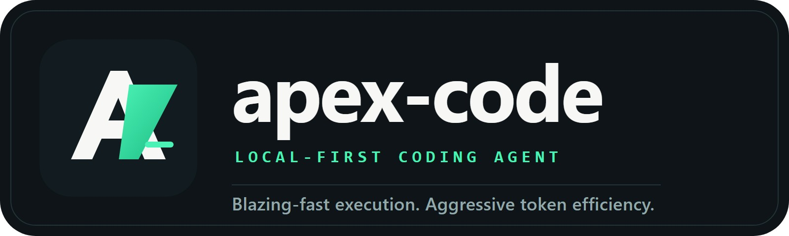
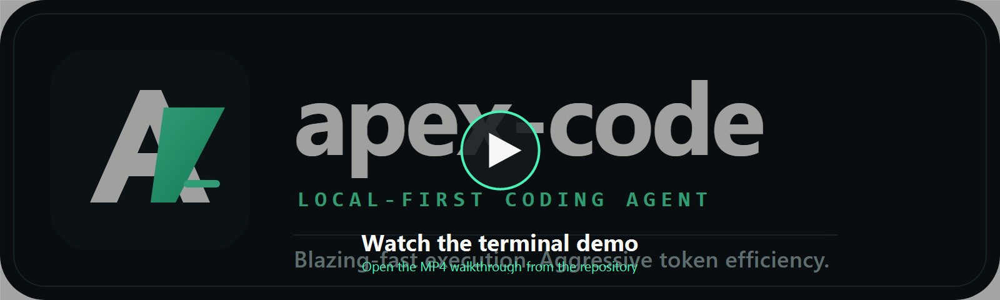
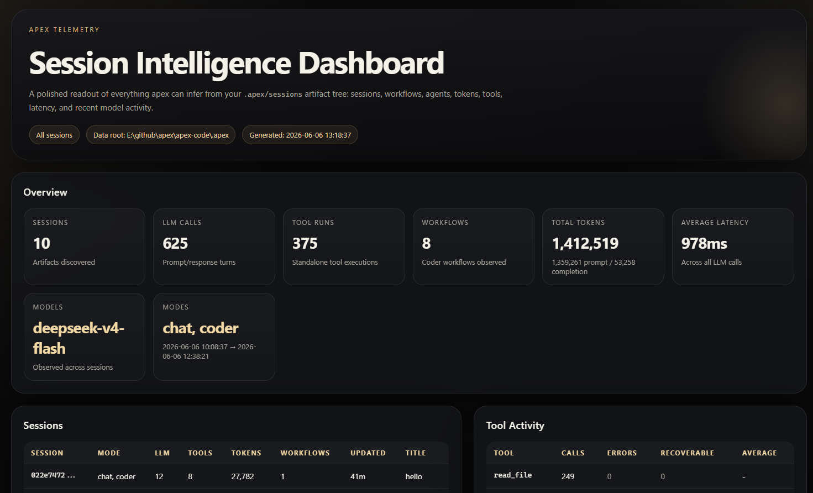

<p align="center">
  
</p>

<p align="center">
  <strong>apex-code</strong> — a local-first, token-efficient coding agent for your terminal.
</p>

<p align="center">
  <em>Works with Ollama or OpenAI-compatible chat models. Keeps your context window lean. Lives in a polished TUI.</em>
</p>

---

## Demo

<p align="center">
  <a href="assets/apex-code.mp4">
    
  </a>
</p>

GitHub's repository README renderer does not reliably display inline video players,
so the preview above links directly to [`assets/apex-code.mp4`](assets/apex-code.mp4).

## Why apex-code?

Most coding agents assume a frontier cloud model and a fat context window. apex-code
takes the opposite bet: small local models, a tight token budget, and a workflow that
treats context as the scarcest resource.

- Flexible backends: Ollama by default, OpenAI-compatible providers when configured.
- Token-efficient runtime: budgeting, compaction, lazy tool loading, and inspectable telemetry.
- Workflow-aware coder mode: plan, review, approve, and execute longer jobs in steps.
- Polished TUI: a real terminal workspace with panes, sessions, and live status.

## Install

Requirements:

- Go 1.22+
- Ollama running locally with at least one pulled model for the default local path

If you want to use OpenAI instead, you only need an API key and a `.env` file or
exported environment variables. Ollama is not required for that path.

Windows:

```powershell
go build -o apex.exe ./cmd/apex
```

Linux / macOS:

```bash
go build -o apex ./cmd/apex
```

## Quick start

OpenAI-compatible setup:

```dotenv
APEX_PROVIDER=openai
OPENAI_API_KEY=sk-...
APEX_MODEL=gpt-4o-mini
```

Run the TUI:

```bash
./apex
```

Useful first commands inside the TUI:

- `/coder` to enter planner-backed coder mode
- `/chat` to return to normal chat mode
- `/approve` to run an approved coder plan
- `/resume` to reopen a previous session

One-shot usage:

```bash
./apex "explain the architecture of this repo"
git diff | ./apex "review these changes"
```

Stats and session artifacts:

<p align="center">
  
</p>

```bash
./apex --stats
./apex stats
./apex stats -session <session-id>
./apex stats -data-dir /path/to/.apex
```

By default apex reads and writes session data under `.apex/`. Use `-data-dir`
or `APEX_DATA_DIR` to point at a different artifact directory. The stats command
parses `.apex/sessions/`, generates a luxury dark HTML dashboard under
`.apex/stats/index.html`, and opens it in your default browser.

Provider selection is automatic:

- If `.env` or your shell exports `APEX_PROVIDER=openai` or `OPENAI_API_KEY`, apex uses OpenAI.
- Otherwise apex defaults to Ollama.

## What You Get

- Interactive TUI with markdown rendering, panes, scrolling transcript, and live stats
- Coder mode with orchestrator, planner, workflow JSON, review, approve, and execution
- Built-in tools for reading, editing, searching, running commands, and fetching content
- File-based sessions under `.apex/sessions/<session-id>/`
- Structured per-session telemetry with raw LLM I/O, tool arguments, tool results, and provider-reported token usage

## Docs

The main README stays intentionally short. Use the docs below for the deeper material:

- [User guide](docs/USER_GUIDE.md): TUI features, slash commands, coder mode, tools, and daily usage
- [Configuration](docs/CONFIGURATION.md): providers, `.env`, flags, budgeting, and on-disk layout
- [Operations](docs/OPERATIONS.md): sessions, telemetry, `apex stats`, and troubleshooting-oriented runtime details
- [Architecture](docs/ARCHITECTURE.md): runtime layers, request flow, compaction, and execution model
- [Extensibility](docs/EXTENSIBILITY.md): `apex.toml`, MCP servers, and native Go plugins
- [Patch format](docs/PATCH_FORMAT.md): patch conventions used by the repo
- [Example config](docs/apex.toml.example): sample `apex.toml`

## Contributing

Build and test before sending changes:

```bash
go build ./...
go test ./...
```

## License

MIT
