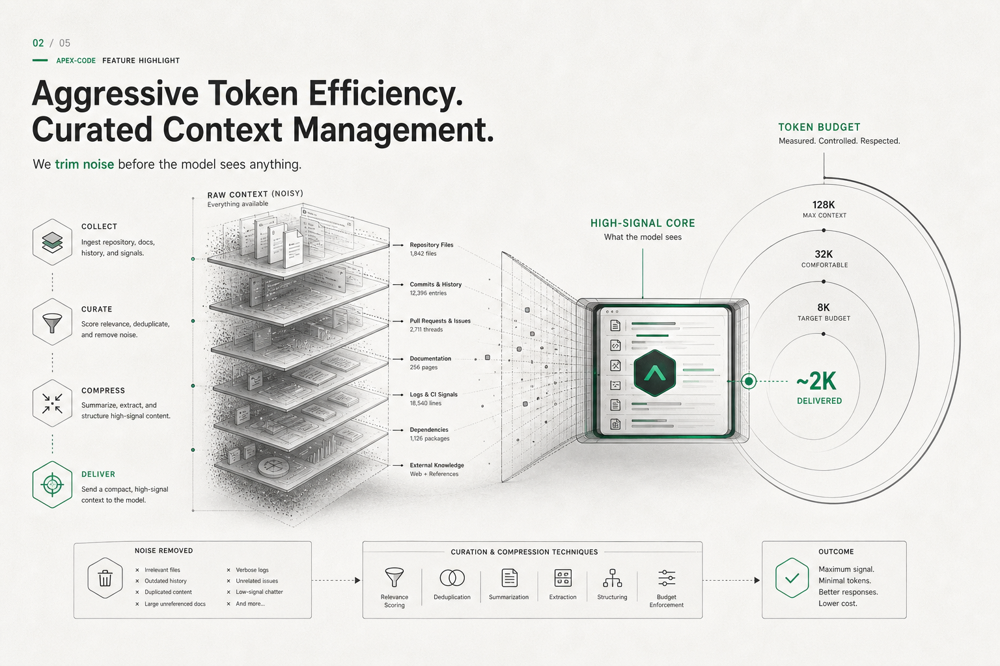
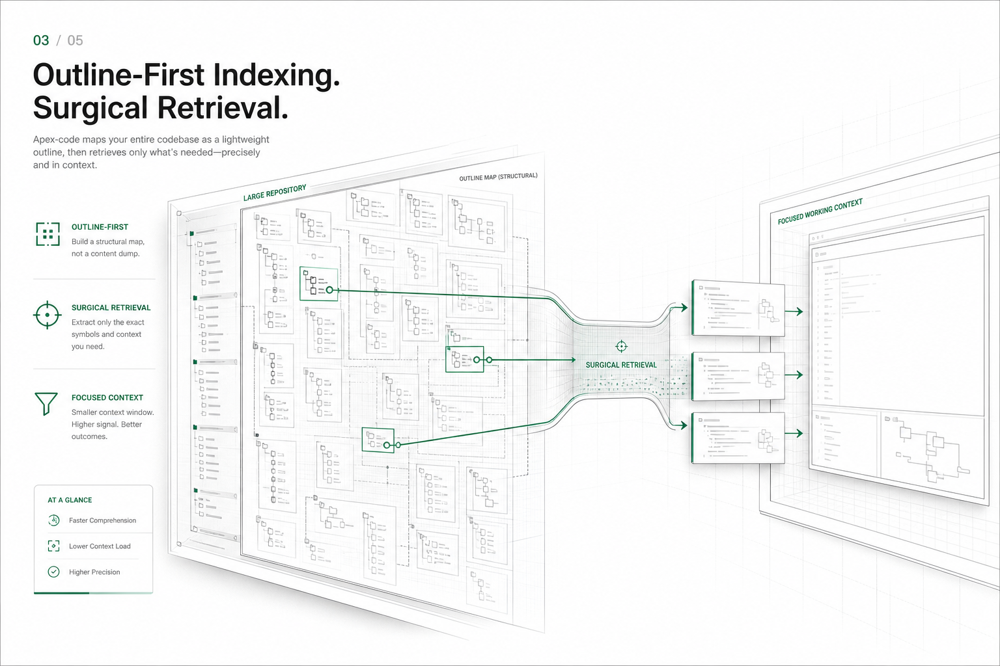

<p align="center">
  
</p>

<p align="center">
  <strong>apex-code</strong> — a local-first, token-efficient coding agent for your terminal.
</p>

<p align="center">
  <em>Talks to local models via Ollama. Keeps your context window lean. Lives in a polished TUI.</em>
</p>

---

## Demo

<p align="center">
  <a href="assets/apex-code.mp4">
    
  </a>
</p>

GitHub's repository README renderer does not reliably display inline video players,
so the preview above links directly to [`assets/apex-code.mp4`](assets/apex-code.mp4).

## Why apex-code?

Most coding agents assume a frontier cloud model and a fat context window. apex-code
takes the opposite bet: small local models, a tight token budget, and a workflow that
treats context as the scarcest resource.

- **Local-first.** Runs against Ollama models on your machine. No API keys, no egress.
- **Token-efficient.** A budget-aware context manager keeps prompts small and predictable.
- **Workflow-aware.** Coder mode can turn larger jobs into a persisted, reviewable plan.
- **Polished TUI.** A real terminal workspace, not a logline firehose.
- **Transparent.** Every token, tool call, and patch is inspectable.

## Table of contents

- [Install & build](#install--build)
- [Quick start](#quick-start)
- [Features](#features)
  - [Feature snapshots](#feature-snapshots)
  - [Interactive TUI workspace](#interactive-tui-workspace)
  - [Coder mode](#coder-mode)
  - [Streaming output with the weave animation](#streaming-output-with-the-weave-animation)
  - [Color themes](#color-themes)
  - [Footer companion](#footer-companion)
  - [Slash commands & @file references](#slash-commands--file-references)
  - [Token budget & context manager](#token-budget--context-manager)
  - [Tools](#tools)
  - [Lazy tool loading](#lazy-tool-loading)
  - [Skills](#skills)
  - [MCP servers](#mcp-servers)
  - [Sessions](#sessions)
  - [Telemetry & tracing](#telemetry--tracing)
- [Configuration](#configuration)
- [CLI reference](#cli-reference)
- [Architecture](#architecture)
- [Contributing](#contributing)
- [License](#license)

## Install & build

apex-code ships as a single Go binary. There is no Makefile or CI — build it directly
with the Go toolchain.

**Requirements**

- **Go 1.22+**
- **[Ollama](https://ollama.com)** running locally with at least one model pulled
  (e.g. `ollama pull gemma3:2b`)

**Windows (PowerShell)**

```powershell
go build -o apex.exe ./cmd/apex
```

**Linux / macOS**

```bash
go build -o apex ./cmd/apex
```

## Quick start

```bash
# interactive TUI
./apex

# inside the TUI, switch to planner-backed coder mode
# /mode coder

# one-shot prompt
./apex "explain the architecture of this repo"

# pipe context in
git diff | ./apex "review these changes"
```

apex picks its mode automatically: a bare invocation opens the TUI, a prompt argument
runs one-shot, and piped stdin is folded into the prompt. Force either direction with
`-tui` or `-one-shot`.

## Features

### Feature snapshots

#### Token efficiency dashboard



#### Outline-first retrieval



### Interactive TUI workspace

A full Bubble Tea workspace rather than a scrolling log:

- Branded landing banner that collapses into a compact header once a chat begins.
- Mode switching between the normal chat flow and a new JSON-driven **coder mode**.
- A height-bounded, scrollable transcript with a live **scrollbar** (mouse wheel,
  `PgUp`/`PgDn`, `Home`/`End`, and arrow keys when the composer is empty).
- **Markdown rendering** of assistant replies (headings, lists, bold, inline code).
- Inspection **panes** you can cycle with `Tab`/`ctrl+o`: tools, diffs, context,
  stats, help, and the coder plan.
- A live **stats strip** with the token-budget meter, always in view.
- Fast workspace shortcuts: `Shift+Enter` for multiline input, `alt+p` to cycle
  the companion, and `alt+t` to cycle themes.

### Coder mode

Coder mode adds a workflow-oriented execution path for longer coding jobs:

- `/mode coder` switches the session into coder mode.
- Your prompt is first routed through an **orchestrator** and **planner**.
- The planner produces a saved workflow JSON plus a human-readable plan pane.
- You can inspect the plan, use `/replan <feedback>` to revise it, `/approve` to
  accept it and begin execution, or `/runplan` to continue an already approved
  workflow.
- Execution is delegated across specialized roles such as `architecture`,
  `solutioner`, `tester`, and `reviewer`.
- Workflow state, task status, active agent, and recent agent runs are persisted
  and restored on session resume.

Workflow files are stored as JSON next to the local state database, so the plan
and execution trace remain inspectable outside the TUI too.

### Streaming output with the weave animation

Assistant replies stream token-by-token as the model produces them. Freshly arrived
characters first appear as a shimmering patch of random glyphs at the writing edge,
then settle left-to-right into the real text — as if the model is *weaving* noise into
words. The shimmer is rate-adaptive, so a fast token stream never grows an unbounded
patch of noise. (It's the text cousin of the footer pet: pure state advanced one frame
per animation tick.)

### Color themes

Re-skin the entire workspace at runtime, the same way you swap the companion. Cycle
themes with `alt+t` or `/theme`, or jump straight to one with `/theme <name>`.
Built-in palettes:

`emerald` (default) · `ocean` · `sunset` · `grape` · `mono`

### Footer companion

A small spring-animated pet wanders the footer, naps while the agent is working, and
wakes when it's done. Cycle through 12 personas (cat, fox, rabbit, dog, panda, bear,
koala, tiger, lion, monkey, frog, penguin) with `alt+p` or `/companion`.

### Slash commands & @file references

Type `/` for command completion and `@` for fuzzy file completion drawn from a
gitignore-aware index of the project. Referenced files are passed to the agent as exact
relative paths.

| Command | What it does |
|---|---|
| `/help` | Command reference |
| `/explain` `/review` `/fix` `/test` | Insert a prompt starter |
| `/model [name]` | Show or switch the active model |
| `/mode [chat|coder]` | Show or switch the active interaction mode |
| `/plan` | Print the current coder workflow plan into chat |
| `/approve` | Approve the current coder-mode plan and start execution |
| `/replan <feedback>` | Ask the planner to revise the current plan |
| `/runplan` | Continue executing the current approved workflow |
| `/resume [id]` · `/sessions` · `/new` | Session management |
| `/pane [name]` | Switch the auxiliary pane (`chat`, `tools`, `diffs`, `context`, `stats`, `help`, `plan`) |
| `/pin` · `/unpin` | Pin/unpin files into the visible working set |
| `/stats` | Focus the stats pane |
| `/prompts` | List prompt starters |
| `/companion` | Switch the footer companion |
| `/theme [name]` | Cycle or set the color theme |
| `/verbose` | Toggle expanded technical detail |
| `/clear` · `/quit` | Clear the transcript · exit |

### Token budget & context manager

A budget-aware context manager assembles each prompt from sized pools — system, tools,
history, retrieved, working files — plus an output headroom reserve. When a turn would
overflow the prompt limit, a compactor shrinks history until it fits. Every pool limit
is tunable via `APEX_BUDGET_*` env vars (see [Configuration](#configuration)).

### Tools

Built-in tools the agent can call to act on the real workspace:

| Tool | Purpose |
|---|---|
| `read_file` | Read a file |
| `write_file` | Create/overwrite a file |
| `edit` | Apply a targeted edit to a file |
| `list_dir` | List a directory |
| `glob` | Find files by glob pattern |
| `grep` | Search file contents |
| `run` | Execute a shell command |
| `fetch` | Fetch and index a URL |

Edits surface in the **diffs** pane before they land, so you can see exactly what the
agent changed.

### Lazy tool loading

With `-lazy-tools`, the system prompt advertises only tool and skill *names*; full
JSON schemas are injected a turn at a time as the model (or your prompt) asks for them.
This keeps the tools pool tiny and is accounted for in telemetry as `lazy_tools`
savings.

### Skills

Drop skill bundles into a skills directory (`-skills`, default `./skills`). In lazy
mode their descriptions are advertised alongside tools so the model can request one by
name without paying for the full bundle up front.

### MCP servers

apex-code speaks the Model Context Protocol. Configure MCP servers in your settings to
expose their tools to the agent, and use the `apex mcp` subcommand to manage them.

### Sessions

Conversations are persisted to a local SQLite store with their working set. Resume the
latest or a specific session with `-resume latest` / `-resume <id>`, or from inside the
TUI with `/resume`. List recent sessions with `apex sessions` or `/sessions`, and start
a clean window with `/new`.

Coder-mode workflows are persisted separately as JSON and automatically reattached
when a resumed session has recent workflow state.

### Telemetry & tracing

Every turn is recorded to the local state DB across multiple dimensions:

- **Consumption** — prompt / completion / total tokens, cache-creation & cache-read.
- **Cache efficiency** — cache-hit ratio.
- **Latency** — per-turn duration and average latency.
- **Timestamps** — first/last activity per scope (RFC 3339).
- **Model traces** — usage rolled up per model.
- **Session map** — usage rolled up per session id.
- **Savings** — what the context manager and lazy tools saved you.

Inspect it all with `apex stats`:

```bash
apex stats                       # totals (tokens, cache-hit, avg latency, models, last seen)
apex stats -by-model             # per-model breakdown
apex stats -by-session           # per-session breakdown
apex stats -trace 20             # 20 most recent turn-level traces
apex stats -session <id>         # scope any of the above to one session
```

## Configuration

apex-code reads configuration from flags and environment variables (flags win).

| Flag | Env | Default | Description |
|------|-----|---------|-------------|
| `-model` | `APEX_MODEL` | `gemma3:2b` | Ollama model tag |
| `-ollama-url` | `APEX_OLLAMA_URL` | `http://localhost:11434` | Ollama server URL |
| `-max-iterations` | `APEX_MAX_ITERATIONS` | `50` | Max agent loop turns |
| `-lazy-tools` | `APEX_LAZY_TOOLS` | `false` | Advertise tool names; load schemas on demand |
| `-skills` | `APEX_SKILLS_DIR` | `./skills` | Skill bundles directory |
| `-state-db` | `APEX_STATE_DB` | (data dir) | SQLite state database path |
| `-resume` | `APEX_RESUME` | — | Resume a prior session (`id` or `latest`) |
| `-verbose` | — | `false` | Expanded technical detail in the TUI |
| `-tui` / `-one-shot` | — | (auto) | Force interactive / non-interactive mode |
| — | `APEX_DATA_DIR` | OS data dir | Base directory for state |

**Budget pools** — tune how the prompt is divided:

`APEX_BUDGET_SYSTEM` · `APEX_BUDGET_TOOLS` · `APEX_BUDGET_HISTORY` ·
`APEX_BUDGET_RETRIEVED` · `APEX_BUDGET_WORKING_FILES` · `APEX_BUDGET_OUTPUT_HEADROOM`

By default, coder-mode workflow files live in a sibling `workflows/` directory
next to the configured state DB.

## CLI reference

```
apex [flags] [prompt]      run interactively, one-shot, or from a pipe
apex stats [flags]         show telemetry (see Telemetry & tracing)
apex sessions [flags]      list recent sessions
apex mcp [flags]           manage MCP servers
```

## Architecture

```
cmd/apex            entrypoint
internal/cli        flag parsing, modes, dependency wiring
internal/tui        Bubble Tea workspace (view, model, themes, pet, streaming)
internal/agent      the agent loop, budgeting, compaction
internal/codermode  JSON workflow store + orchestrator/planner/execution engine
internal/provider   model backends (ollama, plus openai/anthropic/fake adapters)
internal/contextmgr budget-aware context assembly
internal/tools      built-in + MCP + dynamic/lazy tool registry
internal/skills     skill bundle discovery
internal/session    session persistence
internal/telemetry  SQLite metrics store and rollups
```

For a fuller walkthrough of the runtime layers, request flow, token-efficiency
design, persistence model, and extension points, see
[`docs/ARCHITECTURE.md`](docs/ARCHITECTURE.md).

## Contributing

This is an open-source project and contributions are welcome. Build with the Go
toolchain, keep new code covered by tests, and run the suite before sending a change:

```bash
go build ./...
go test ./...
```

## License

MIT
